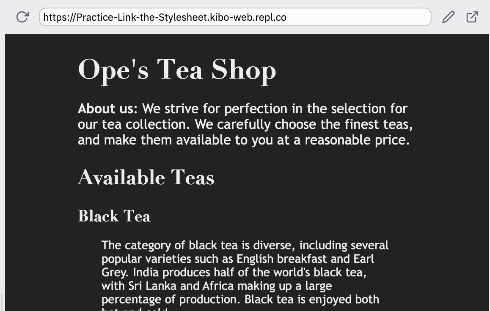
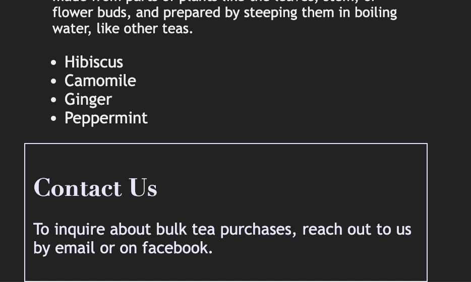

# Practice: Select the elements

* `index.html` has some elements that need styling!
*  `style.css` has the styles

All that's left to do is select the right elements.

Add selectors to each of the rules in `style.css` to select the elements described in the comments.

When all the selectors are in place, the site should look like this:

And the footer should look like this:

Here's a list of styles that should apply to which elements:
* The body should get a dark background color, a light text color, a max-width of 400px, and an 'auto' margin value to center the elements
*  the headings should use the Didot font, or serif as a fallback, and have no bottom margin
*  The paragraphs and list items should get the font Trebuchet MS, or sans-serif as a fallback.
* All the descriptions should have a smaller font size, a 1em margin, and some left and right padding. 
 * The contact form at the bottom should use the Verdana font, be lavender colored, and have a solid lavender border, with padding of 8px.

## Hint

You don't need to know what any of the styles actually mean. Just change the selectors to choose the correct elements!